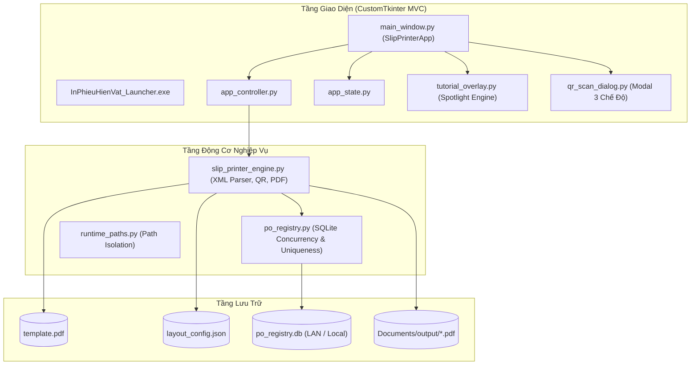

# 🖨️ In Phiếu Hiện Vật (Kyocera Slip Printer)

Ứng dụng Desktop Windows chuyên dụng phục vụ việc đọc dữ liệu sản xuất từ Excel, quét mã QR súng bắn, tự động cấp phát và kiểm soát tính duy nhất của mã PO qua SQLite mạng LAN, và kết xuất phiếu hiện vật ra file PDF chuẩn A4 (4 nhãn / trang) tích hợp phôi mẫu `template.pdf`.

---

## 🌟 Tính Năng Nổi Bật (Key Features)

1. **Nạp Dữ Liệu Nhanh từ Excel (High-Speed Excel Import):**
   - Đọc trực tiếp cấu trúc XML của file Excel (`.xlsx`) không cần cài đặt Microsoft Excel.
   - Tự động nhận diện dữ liệu từ dòng 28 (cột A:J), tính toán tổng số lượng (`Số lượng thùng × Số box`).
   - Kiểm tra và highlight màu đỏ cảnh báo nếu phát hiện trùng lặp mã PO đã từng in trong lịch sử.

2. **Quét Mã QR Thông Minh 3 Chế Độ (Smart QR Scanner Modal):**
   - **Phân tách (分割 - `MODE_SPLIT`):** Tách lô hàng lớn thành các thùng nhỏ, tự động tăng mã PO chi tiết (`10010` $\rightarrow$ `20010` $\rightarrow$ `90010`).
   - **Hoàn kho (戻入 - `MODE_RETURN`):** Nhập hàng hoàn trả về kho, tự động tăng mã nhánh con (`11010` $\rightarrow$ `21010` $\rightarrow$ `91010`).
   - **Bóc tách / Nhập tem (`MODE_DECODE`):** Giải mã chuỗi QR 122/129 ký tự tiêu chuẩn thành các trường thông tin chi tiết trên Form.

3. **Quản Lý & Chống Trùng PO Tuyệt Đối (Zero Duplicate PO Guarantee):**
   - Định dạng tự động: `11YYMMDDNN` (`11` + Ngày `YYMMDD` + Số thứ tự ngày `01-99`).
   - Concurrency Safety: Sử dụng SQLite Transaction `BEGIN IMMEDIATE` khóa nguyên tử, ngăn chặn hoàn toàn race-condition giữa các máy trạm.
   - Khóa chính 4 thành phần: `PRIMARY KEY (po, po_detail, po_sub, box)` ngăn chặn trùng lặp mọi lúc mọi nơi.
   - Đồng bộ mạng LAN: Cơ sở dữ liệu mặc định trỏ về Server chia sẻ nội bộ `\\fstvn01\...` để các bộ phận dùng chung.

4. **Kết Xuất PDF Chuẩn & Xem Trước Trực Quan (PDF Generation & Live Preview):**
   - Kết xuất PDF tốc độ cao với ReportLab & PyMuPDF, ghép đè lên phôi `template.pdf`.
   - Bố cục 4 phiếu / trang A4 chuẩn công nghiệp.
   - Xem trước trực quan (Live Canvas Preview) từng nhãn trước khi in.
   - Hỗ trợ chỉnh sửa và lưu tọa độ in (`layout_config.json`).

5. **Hướng Dẫn Tương Tác Trực Quan (Interactive Tutorial Overlay):**
   - Lớp phủ spotlight bán trong suốt hướng dẫn từng bước quy trình 4 nghiệp vụ cốt lõi ngay trên màn hình.
   - Tự động gợi ý cho người dùng trong lần khởi chạy đầu tiên.

6. **Tự Động Cập Nhật Mạng Nội Bộ (LAN Auto-Updater):**
   - Cập nhật phiên bản qua mạng LAN không cần quyền Administrator (per-user install).
   - Kiểm tra mã băm SHA-256, cơ chế sao lưu tự động và rollback an toàn.

---

## 🏛️ Sơ Đồ Kiến Trúc (Architecture)



---

## 🚀 Hướng Dẫn Cài Đặt & Chạy (Quick Start)

### 1. Chạy từ Mã Nguồn (Development Mode)
Yêu cầu Python >= 3.10:
```bash
# 1. Cài đặt các thư viện phụ thuộc
pip install -r requirements.txt

# 2. Chạy ứng dụng
python slip_printer_app.py

# 3. Kiểm tra trạng thái hệ thống không mở GUI
python slip_printer_app.py --health-check
```

### 2. Chạy Bộ Test Tự Động (Automated Testing)
```bash
pytest -v
```

### 3. Đóng Gói Ứng Dụng (Build Installer / Release)
```bash
# Đóng gói ứng dụng thành Installer Inno Setup
python package_app.py
```
Bộ cài đặt sau khi đóng gói sẽ nằm tại `release_artifacts/InPhieuHienVat_Setup_x.x.x.exe`.

---

## 📁 Cấu Trúc Thư Mục (Folder Structure)

```text
PM_in_lai_phieuhienvat/
├── core/                        # Động cơ cốt lõi
│   ├── po_registry.py           # SQLite generator & uniqueness checker
│   ├── runtime_paths.py         # Quản lý đường dẫn runtime & LAN DB
│   └── slip_printer_engine.py   # Bộ nạp Excel, tạo QR, ghép PDF
├── ui/                          # Giao diện người dùng (CustomTkinter)
│   ├── components/              # Các panel và modal dialogs
│   │   ├── qr_scan_dialog.py    # Cửa sổ quét QR 3 chế độ
│   │   ├── tutorial_overlay.py  # Động cơ Spotlight Tutorial
│   │   └── tutorial_script.py   # Kịch bản 4 bước hướng dẫn
│   ├── app_controller.py        # Controller điều phối
│   ├── app_state.py             # Quản lý trạng thái
│   └── main_window.py           # Cửa sổ chính
├── updater/                     # Bộ cập nhật tự động LAN
├── tests/                       # Bộ kiểm thử tự động (Unit / Stress / E2E)
├── docs/                        # Tài liệu chi tiết dự án
├── template.pdf                 # Phôi phiếu mẫu
├── layout_config.json           # Tọa độ in nhãn
├── package_app.py               # Script đóng gói
└── requirements.txt             # Thư viện phụ thuộc
```

---

## 📄 Bản Quyền & Giấy Phép (License)
Dự án được bảo vệ và phát triển bởi Đội ngũ Kỹ thuật Sản xuất (Production Engineering).
Mọi quyền được bảo lưu.