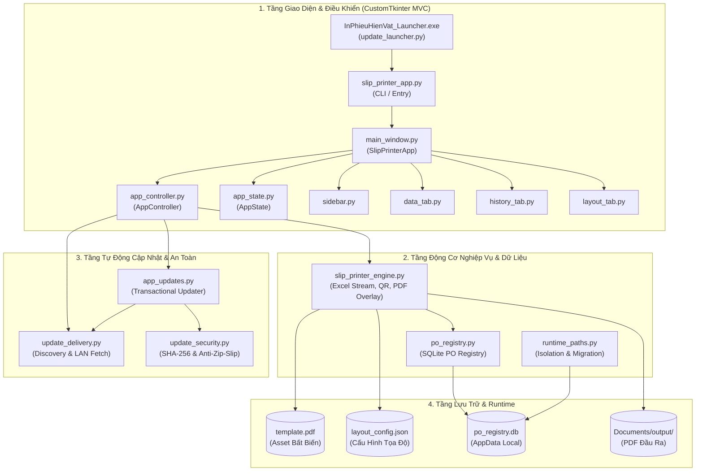

# 🚀 Hướng Dẫn Tiếp Nhận Dự Án (Onboarding Guide)
## Dự án: In Phiếu Hiện Vật (`PM_in_lai_phieuhienvat`)

> **Dành cho:** Lập trình viên mới tiếp nhận codebase, bảo trì hoặc phát triển tính năng mới.  
> **Cập nhật lần cuối:** 2026-08-17 (Theo Đồ Thị Tri Thức `.understand-anything`)

---

## 1. 📖 Tổng Quan Dự Án (Project Overview)

- **Tên dự án:** In Phiếu Hiện Vật (`PM_in_lai_phieuhienvat`)
- **Ngôn ngữ chính:** Python (>= 3.10), JSON, Batch Script, Inno Setup Script (.iss)
- **Framework & Thư viện nòng cốt:**
  - **Giao diện Desktop:** `CustomTkinter`, `Tkinter`
  - **Xử lý PDF & Ảnh:** `ReportLab`, `PyMuPDF (fitz)`, `PyPDF2`, `Pillow (PIL)`, `qrcode`
  - **Đọc Excel:** Phân tích XML Streaming tự tạo (`xml.etree.ElementTree`, `zipfile`), `openpyxl`
  - **Cơ sở dữ liệu:** `SQLite3` (Chế độ `WAL`)
  - **Đóng gói & Phân phối:** `PyInstaller` (chế độ `--onedir`), `Inno Setup 6`
- **Mục đích nghiệp vụ:** Đọc dữ liệu phiếu sản xuất từ file Excel, chuẩn hóa thông tin, sinh mã QR 122 ký tự fixed-width, tạo và ghép lớp dữ liệu lên phôi `template.pdf` (in 4 nhãn/trang A4 hoặc 1 nhãn/trang) và đảm bảo tính duy nhất của mã PO qua SQLite cục bộ.

---

## 2. 🏛️ Sơ Đồ Kiến Trúc Hệ Thống (Architecture Map)



---

## 3. 🧩 Các Tầng Kiến Trúc (Architecture Layers)

### 3.1 Giao diện & Điểm khởi chạy (`layer:entry-presentation`)
- **Nhiệm vụ:** Điểm đón người dùng, cung cấp giao diện đồ họa hiện đại với CustomTkinter, quản lý các tác vụ bất đồng bộ qua worker thread để giao diện không bị treo (freeze).
- **Thành phần chính:**
  - `slip_printer_app.py`: Khởi động ứng dụng, xử lý CLI `--health-check`.
  - `ui/main_window.py`: Cửa sổ trung tâm, thanh tiến trình, điều phối các tab.
  - `ui/app_controller.py`: Controller trung gian điều khiển nghiệp vụ giữa UI và Core Engine.
  - `ui/app_state.py`: Mô hình trạng thái tập trung (AppState).
  - `ui/components/`: Các panel chức năng (`data_tab.py`, `history_tab.py`, `layout_tab.py`, `sidebar.py`).

### 3.2 Động cơ nghiệp vụ & Dữ liệu cốt lõi (`layer:core-engine`)
- **Nhiệm vụ:** Đọc nhanh file Excel, sinh payload QR, kết xuất lớp PDF dữ liệu, ghép với template và lưu vết PO.
- **Thành phần chính:**
  - `core/slip_printer_engine.py`: Xử lý streaming XML Excel từ dòng 28 cột A-J, tạo QR 122 ký tự, vẽ overlay ReportLab và ghép lên PDF nền mẫu.
  - `core/po_registry.py`: SQLite generator sinh PO `11YYMMDDNN`, ràng buộc khóa chính `(po, po_detail, po_sub, box)`.
  - `core/runtime_paths.py`: Chuẩn hóa đường dẫn tài nguyên tĩnh và phân tách dữ liệu động ra `AppData\Local`.

### 3.3 Tự động cập nhật & Bảo mật (`layer:updater-delivery`)
- **Nhiệm vụ:** Cập nhật phiên bản ứng dụng trong môi trường mạng nội bộ doanh nghiệp mà không cần quyền Admin.
- **Thành phần chính:**
  - `updater/update_launcher.py`: Bootstrap launcher siêu nhỏ đọc `current.json`.
  - `updater/app_updates.py`: Quy trình transactional update (Stage -> Verify Health Check -> Atomic Switch -> Rollback).
  - `updater/update_delivery.py`: Tải bản cập nhật từ thư mục mạng LAN/UNC hoặc HTTP.
  - `updater/update_security.py`: Xác thực mã băm SHA-256 từng tệp, ngăn ngừa Zip Slip.

### 3.4 Đóng gói & Phân phối (`layer:build-distribution`)
- **Nhiệm vụ:** Tự động hóa quy trình build và tạo bộ cài đặt.
- **Thành phần chính:**
  - `package_app.py`: Pipeline đóng gói PyInstaller onedir, tạo install bundle versioned, kiểm tra health-check và gọi Inno Setup.
  - `installer/InPhieuHienVat.iss`: Kịch bản Inno Setup cấu hình per-user (`{localappdata}\Programs\InPhieuHienVat`).

### 3.5 Kiểm thử tự động (`layer:tests`)
- `tests/test_po_registry.py`: Test sinh mã PO, transaction SQLite, kiểm tra khóa duy nhất và xuất CSV.
- `tests/test_engine.py`: Test tính toán số lượng (`carton_qty × box`), validate Revision, chuẩn hóa format string.

---

## 4. 💡 Các Khái Niệm & Quyết Định Thiết Kế Quan Trọng (Key Concepts)

### 1. Phân Tách Dữ Liệu Bền Vững (Storage & Runtime Isolation)
- **Vấn đề:** Ứng dụng khi cập nhật versioned không được làm mất lịch sử PO, cài đặt layout hoặc các file PDF đã tạo của người dùng.
- **Giải pháp:**
  - File binary/code nằm trong `apps/<version>/`.
  - Dữ liệu người dùng nằm tại `%LOCALAPPDATA%\InPhieuHienVatData\` (`po_registry.db`, `layout_config.json`).
  - File PDF xuất ra lưu tại `%USERPROFILE%\Documents\InPhieuHienVat\output\`.
  - Khi cần di chuyển database SQLite đang bật WAL, luôn dùng **SQLite Backup API** (`sqlite3.Connection.backup`), tuyệt đối không copy file `.db` đơn thuần.

### 2. Quy Tắc Sinh Mã PO & Ràng Buộc Khóa Duy Nhất (Composite Key)
- Ba trường `PO`, `PO chi tiết` (`00010`), `PO phụ` (`+001`) được khóa trên form và tự sinh tự động.
- Cú pháp PO: `11YYMMDDNN` (`NN` từ `01` đến `99` mỗi ngày).
- Khóa chính SQLite: `(po, po_detail, po_sub, box)`. Cùng một PO nhưng khác số box là hợp lệ.

### 3. Quy Tắc Đọc Dữ Liệu Excel & Tính Tổng Số Lượng
- Bảng tính đọc từ **dòng 28**, cột `A` đến `J`.
- Cột A: Mã hàng | Cột B: Tên hàng | Cột C: SL ghi trên Excel (tham khảo) | Cột D: Số lượng thùng | Cột G: Số box (vd: `001/003`) | Cột H: Rev | Cột I: Ngày/Lot.
- **Quy tắc bất biến:** `Tổng số lượng` luôn được tính lại bằng công thức:  
  $$\text{Tổng SL} = \text{Số lượng thùng} \times \text{segment cuối của Số box}$$  
  *(Ví dụ: 20 thùng $\times$ box `001/003` $\rightarrow$ Tổng SL = 60)*.

### 4. Quy Trình Cập Nhật Transactional (Safe Auto-Update)
- Không ghi đè trực tiếp lên ứng dụng đang chạy.
- Tải gói cập nhật $\rightarrow$ Giải nén vào `apps/<new_version>/` $\rightarrow$ Chạy lệnh `--health-check` ngầm $\rightarrow$ Ghi file `current.json` $\rightarrow$ Hoàn tất. Nếu lỗi, hoàn tác ngay lập tức về phiên bản cũ.

---

## 5. 🗺️ Lộ Trình Tiếp Nhận Codebase (Guided Tour)

| Thứ tự | Chủ đề | Tệp trọng tâm | Mục tiêu cần nắm |
|:---|:---|:---|:---|
| **1** | **Tài liệu & Hợp đồng** | [`HANDOVER.md`](file:///d:/Sandbox/PM_in_lai_phieuhienvat/HANDOVER.md), [`release.json`](file:///d:/Sandbox/PM_in_lai_phieuhienvat/release.json) | Đọc kỹ contract dữ liệu Excel/QR và quy chuẩn bàn giao. |
| **2** | **Điểm khởi chạy & UI** | [`slip_printer_app.py`](file:///d:/Sandbox/PM_in_lai_phieuhienvat/slip_printer_app.py), [`ui/main_window.py`](file:///d:/Sandbox/PM_in_lai_phieuhienvat/ui/main_window.py), [`ui/app_controller.py`](file:///d:/Sandbox/PM_in_lai_phieuhienvat/ui/app_controller.py) | Hiểu cấu trúc khởi động, CustomTkinter và cơ chế MVC. |
| **3** | **Tab dữ liệu & Preview** | [`ui/components/data_tab.py`](file:///d:/Sandbox/PM_in_lai_phieuhienvat/ui/components/data_tab.py), [`layout_config.json`](file:///d:/Sandbox/PM_in_lai_phieuhienvat/layout_config.json) | Cách nạp bảng dữ liệu, chỉnh sửa record và xem trước trang in. |
| **4** | **Động cơ In ấn & QR** | [`core/slip_printer_engine.py`](file:///d:/Sandbox/PM_in_lai_phieuhienvat/core/slip_printer_engine.py), [`tests/test_engine.py`](file:///d:/Sandbox/PM_in_lai_phieuhienvat/tests/test_engine.py) | Thuật toán stream XML, sinh chuỗi QR 122 ký tự và ghép lớp PDF. |
| **5** | **SQLite PO Registry** | [`core/po_registry.py`](file:///d:/Sandbox/PM_in_lai_phieuhienvat/core/po_registry.py), [`core/runtime_paths.py`](file:///d:/Sandbox/PM_in_lai_phieuhienvat/core/runtime_paths.py) | Transaction SQLite WAL, sequence 99/ngày và cô lập AppData. |
| **6** | **Auto-Update An Toàn** | [`updater/app_updates.py`](file:///d:/Sandbox/PM_in_lai_phieuhienvat/updater/app_updates.py), [`updater/update_delivery.py`](file:///d:/Sandbox/PM_in_lai_phieuhienvat/updater/update_delivery.py) | Cơ chế phát hiện, xác thực SHA256, staging và rollback update. |
| **7** | **Build & Đóng Gói** | [`package_app.py`](file:///d:/Sandbox/PM_in_lai_phieuhienvat/package_app.py), [`installer/InPhieuHienVat.iss`](file:///d:/Sandbox/PM_in_lai_phieuhienvat/installer/InPhieuHienVat.iss) | Quy trình build PyInstaller onedir và biên dịch Inno Setup installer. |

---

## 6. 📂 Bản Đồ Tệp Nguồn (File Map by Layer)

| Tầng kiến trúc | Đường dẫn tệp | Độ phức tạp | Chức năng chính |
|:---|:---|:---:|:---|
| **Presentation** | `slip_printer_app.py` | Simple | Entrypoint CLI / GUI launch & `--health-check`. |
| **Presentation** | `ui/main_window.py` | Complex | Cửa sổ CustomTkinter chính, quản lý thanh tiến trình và tabs. |
| **Presentation** | `ui/app_controller.py` | Complex | Bộ điều phối Controller trung tâm, xử lý thread nền và update. |
| **Presentation** | `ui/app_state.py` | Simple | Mô hình trạng thái giao diện tập trung (AppState). |
| **Presentation** | `ui/components/sidebar.py` | Simple | Panel thanh điều hướng bên trái và nút thao tác nhanh. |
| **Presentation** | `ui/components/data_tab.py` | Moderate | Bảng dữ liệu, form chỉnh sửa phiếu và màn hình xem trước. |
| **Presentation** | `ui/components/history_tab.py` | Moderate | Lịch sử PO SQLite, xuất CSV và nút kiểm tra cập nhật. |
| **Presentation** | `ui/components/layout_tab.py` | Moderate | Trình chỉnh sửa tọa độ các trường text và QR trên bản in. |
| **Core Engine** | `core/slip_printer_engine.py` | Complex | Động cơ đọc XML Excel, tạo QR, vẽ ReportLab và ghép PDF. |
| **Core Engine** | `core/po_registry.py` | Moderate | Cơ sở dữ liệu SQLite sinh PO tự động và kiểm tra tính duy nhất. |
| **Core Engine** | `core/runtime_paths.py` | Moderate | Chuẩn hóa đường dẫn AppData/Output và backup SQLite WAL. |
| **Updater** | `updater/app_updates.py` | Complex | Quản lý vòng đời cập nhật: Staging, Health-check, Atomic, Rollback. |
| **Updater** | `updater/update_delivery.py` | Moderate | Tìm kiếm và nạp gói cập nhật từ LAN/UNC/HTTP. |
| **Updater** | `updater/update_launcher.py` | Moderate | Bootstrap launcher độc lập khởi chạy đúng phiên bản active. |
| **Updater** | `updater/update_security.py` | Moderate | Xác thực SHA-256 manifest và chống tấn công Zip Slip. |
| **Packaging** | `package_app.py` | Complex | Kịch bản tự động hóa build onedir, install bundle & Inno Setup. |
| **Packaging** | `installer/InPhieuHienVat.iss` | Moderate | Script biên dịch Inno Setup installer per-user cho Windows. |
| **Tests** | `tests/test_po_registry.py` | Moderate | Test suite kiểm thử SQLite PO Registry. |
| **Tests** | `tests/test_engine.py` | Simple | Test suite kiểm thử nghiệp vụ tính toán và format chuỗi. |
| **Docs/Config** | `HANDOVER.md` | Complex | Tài liệu bàn giao hiện hành của toàn bộ dự án. |
| **Docs/Config** | `layout_config.json` | Moderate | Cấu hình tọa độ in ấn mặc định. |
| **Docs/Config** | `release.json` | Simple | Metadata định danh phiên bản SemVer và schema. |

---

## 7. ⚠️ Vùng Cần Chú Ý Đặc Biệt (Complexity Hotspots)

Khi phát triển hoặc sửa đổi các tệp sau, lập trình viên cần hết sức cẩn trọng:

1. 🔴 **[`core/slip_printer_engine.py`](file:///d:/Sandbox/PM_in_lai_phieuhienvat/core/slip_printer_engine.py)**:
   - *Lý do:* Chứa logic đọc stream XML thô từ tệp Excel, tính toán tọa độ PDF ReportLab và ghép trang bằng PyMuPDF.
   - *Lưu ý:* Mọi thay đổi về cách tính `total_qty` hay định dạng QR 122 ký tự đều ảnh hưởng trực tiếp đến máy quét mã vạch ở xưởng sản xuất.
2. 🔴 **[`ui/app_controller.py`](file:///d:/Sandbox/PM_in_lai_phieuhienvat/ui/app_controller.py)** & **[`ui/main_window.py`](file:///d:/Sandbox/PM_in_lai_phieuhienvat/ui/main_window.py)**:
   - *Lý do:* Quản lý luồng đa nhiệm (multithreading) giữa GUI và worker thread.
   - *Lưu ý:* Không bao giờ cập nhật giao diện CustomTkinter trực tiếp từ thread phụ; luôn điều phối qua controller callback an toàn.
3. 🔴 **[`updater/app_updates.py`](file:///d:/Sandbox/PM_in_lai_phieuhienvat/updater/app_updates.py)**:
   - *Lý do:* Xử lý thay thế binary ứng dụng trong môi trường người dùng đang chạy.
   - *Lưu ý:* Phải đảm bảo quy trình transactional và health check thành công trước khi ghi đè `current.json`.
4. 🔴 **[`package_app.py`](file:///d:/Sandbox/PM_in_lai_phieuhienvat/package_app.py)**:
   - *Lý do:* Pipeline build phức tạp liên kết giữa PyInstaller onedir, launcher và Inno Setup.
   - *Lưu ý:* Luôn chạy thử smoke test và kiểm tra `dist/InPhieuHienVat` trước khi xuất bản setup.

---

## 8. 🛠️ Hướng Dẫn Vận Hành & Lệnh Thường Dùng (Quick Start & Commands)

```powershell
# 1. Chạy ứng dụng từ mã nguồn (Chế độ phát triển)
python slip_printer_app.py

# 2. Kiểm tra sức khỏe không mở giao diện (Health Check)
python slip_printer_app.py --health-check

# 3. Chạy toàn bộ Unit Test
python -m pytest tests/

# 4. Đóng gói ứng dụng hoàn chỉnh (Onedir + Launcher + Inno Setup Installer)
python package_app.py --all

# 5. Tạo gói cập nhật update package (.zip kèm manifest)
python package_app.py --update-only
```
